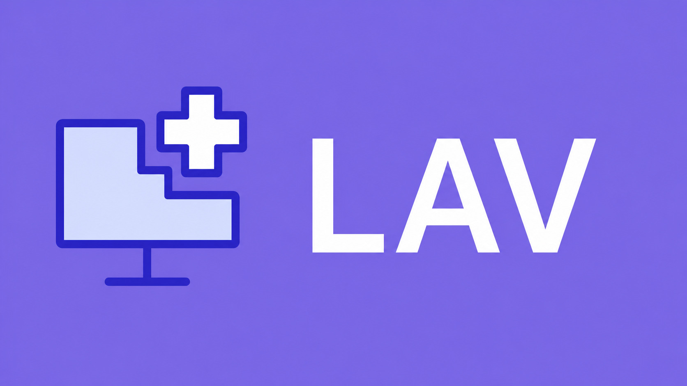

# Sistema de Gestión de Afiliados y Grupo Familiar (LAV) - Backend

Backend desarrollado como una API REST utilizando Node.js, Express, Sequelize y MySQL para la gestión de afiliados de una obra social.

El sistema permite administrar afiliados y grupos familiares, gestionar turnos médicos y recetas, y consultar profesionales, especialidades, disponibilidades y medicamentos.

El backend implementa autenticación mediante JWT, validación de datos con Joi, protección de contraseñas con bcrypt y reglas de negocio relacionadas con permisos familiares, estados de turnos, disponibilidad, cancelaciones y gestión de recetas.

El proyecto se desarrollo aplicando una arquitectura en capas, separando responsabilidades entre Routes, Controllers, Services, Middlewares, Schemas y Models, buscando facilitar el mantenimiento y la escalabilidad del sistema.

<p align="center">  </p>

---

# Tecnologías

## Backend

- Node.js
- Express
- Sequelize
- MySQL
- JWT
- Joi
- bcrypt

## Herramientas

- Sequelize CLI
- Thunder Client
- Git
- GitHub
- Nodemon

---

# Arquitectura

El proyecto fue organizado siguiendo una arquitectura en capas para separar responsabilidades, facilitando el mantenimiento y la escalabilidad del sistema.

## Estructura del proyecto

```text
SISTEMA_SALUD_BACKEND/
│
├── config/
├── migrations/
├── models/
├── seeders/
│
├── src/
│   ├── controllers/
│   ├── middlewares/
│   ├── services/
│   ├── schemas/
│   ├── routes/
│   ├── app.js
│   └── server.js
│
├── .env
├── .gitignore
├── package.json
├── package-lock.json
└── README.md
```

La arquitectura implementada separa claramente las responsabilidades del sistema:

- **Controllers:** reciben las solicitudes HTTP y devuelven las respuestas.
- **Services:** concentran toda la lógica de negocio.
- **Routes:** definen los endpoints de la API.
- **Middlewares:** gestionan la autenticación mediante JWT y la validación de datos.
- **Schemas:** validan la información de entrada utilizando Joi.
- **Models:** representan las entidades mediante Sequelize.
- **Migrations:** administran la estructura de la base de datos.
- **Seeders:** cargan datos iniciales para pruebas y desarrollo.

---

# Funcionalidades

## Afiliados
- Registro de afiliados previamente cargados por la empresa.
- Inicio de sesión mediante autenticación JWT.
- Consulta de información personal.
- Consulta del grupo familiar respetando los permisos del afiliado.

## Grupos familiares
- Consulta de integrantes del grupo familiar.
- Gestión de relaciones entre titular, cónyuge e hijos.
- Control de acceso según el rol del integrante.

## Profesionales y especialidades
- Consulta de especialidades disponibles.
- Consulta y listado de profesionales.
- Filtrado de profesionales por especialidad.

## Disponibilidades
- Consulta de disponibilidades de los profesionales.
- Consulta de horarios disponibles para la reserva de turnos.

## Turnos
- Reserva de turnos médicos.
- Cancelación de turnos.
- Consulta de próximos turnos.
- Consulta del historial de turnos.
- Actualización del estado de las disponibilidades al reservar o cancelar un turno.

## Recetas
- Solicitud de recetas médicas.
- Renovación de recetas.
- Consulta de recetas por afiliado.
- Consulta individual de recetas.
- Medicamentos
- Consulta de medicamentos disponibles.

---

# Base de datos

La persistencia de datos se implementó utilizando MySQL junto con Sequelize ORM.

Sequelize permite definir los modelos y sus relaciones, mientras que Sequelize CLI se utiliza para administrar las migraciones y seeders del proyecto.

El modelo de datos contempla las siguientes entidades principales:

- Grupo Familiar
- Afiliados
- Profesionales
- Especialidades
- Disponibilidades
- Turnos
- Medicamentos
- Recetas

Las relaciones entre estas entidades permiten gestionar los grupos familiares, asociar profesionales con sus especialidades, administrar sus disponibilidades y controlar la reserva de turnos y la gestión de recetas.

---

# Instalación

## Requisitos previos

Antes de comenzar, es necesario tener instalado:

- Node.js
- MySQL
- Git

También es necesario contar con una base de datos MySQL disponible para el proyecto.

### 1. Clonar el repositorio

```bash
git clone https://github.com/tu-usuario/sistema-salud-backend.git
```

### 2. Ingresar al directorio

```bash
cd sistema-salud-backend
```

### 3. Instalar las dependencias

```bash
npm install
```

### 4. Crear el archivo `.env`

Crear un archivo `.env` en la raíz del proyecto:

```env
DB_HOST=localhost
DB_USER=root
DB_PASSWORD=tu_password
DB_NAME=sistema_salud
JWT_SECRET=tu_clave_secreta
```

El archivo `.env` contiene información sensible y no tiene que subirse al repositorio.

### 5. Crear la base de datos

Crear en MySQL una base de datos con el mismo nombre definido en `DB_NAME`.

```sql
CREATE DATABASE sistema_salud;
```

### 6. Ejecutar las migraciones

```bash
npx sequelize-cli db:migrate
```

Crea las tablas y estructuras necesarias para el funcionamiento del sistema.

### 7. Cargar los datos iniciales

```bash
npx sequelize-cli db:seed:all
```

Estos datos incluyen información inicial de afiliados, especialidades, profesionales, disponibilidades y medicamentos.

### 8. Iniciar el servidor

```bash
npm run dev
```

Una vez iniciado, la API queda disponible en la dirección configurada por el proyecto.

---

# Endpoints principales

La API expone diferentes endpoints para gestionar afiliados, grupos familiares y turnos médicos.

## Afiliados

| Método | Endpoint               | Descripción                              |
| ------ | ---------------------- | ---------------------------------------- |
| `POST` | `/afiliados/registro`  | Registra un nuevo afiliado               |
| `POST` | `/afiliados/login`     | Inicia sesión y genera un token JWT      |
| `GET`  | `/afiliados`           | Obtiene el listado de afiliados          |
| `GET`  | `/afiliados/:id`       | Obtiene la información de un afiliado    |
| `GET`  | `/afiliados/grupo/:id` | Obtiene el grupo familiar de un afiliado |

## Turnos

| Método   | Endpoint                        | Descripción                                   |
| -------- | ------------------------------- | --------------------------------------------- |
| `POST`   | `/turnos`                       | Reserva un nuevo turno                        |
| `DELETE` | `/turnos/:id`                   | Cancela un turno                              |
| `GET`    | `/turnos/proximos/:pacienteId`  | Obtiene los próximos turnos de un paciente    |
| `GET`    | `/turnos/historial/:pacienteId` | Obtiene el historial de turnos de un paciente |

Los endpoints protegidos requieren autenticación mediante **JWT**.

Las solicitudes que requieren datos de entrada también cuentan con validación mediante **Joi**.

---

## Autora

**Luana Calderón**

Proyecto desarrollado como parte de mi portfolio de desarrollo backend.

Su diseño y desarrollo fueron realizados de forma personal, aplicando y ampliando los conocimientos adquiridos durante la carrera, especialmente en la materia **Desarrollo de Aplicaciones**, junto con otros conceptos incorporados a lo largo de mi formación académica.
